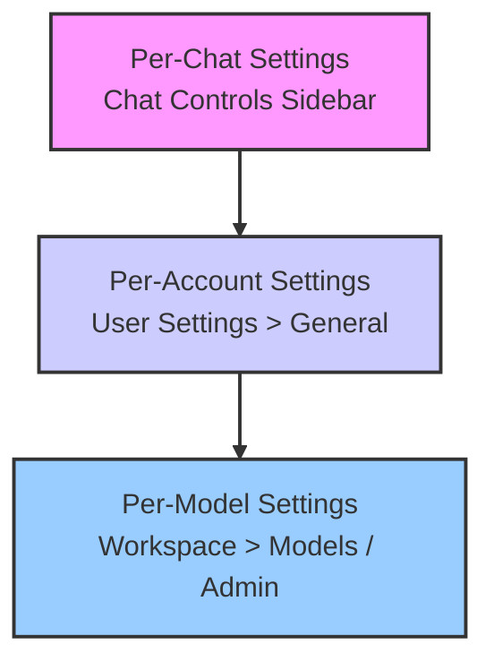
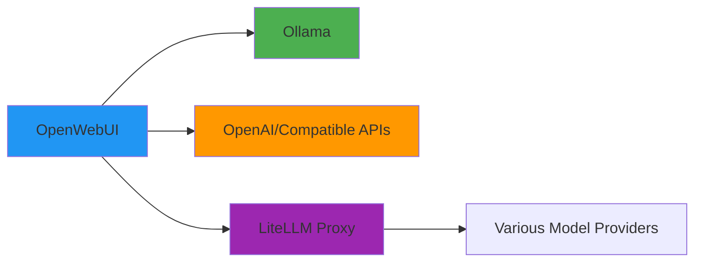
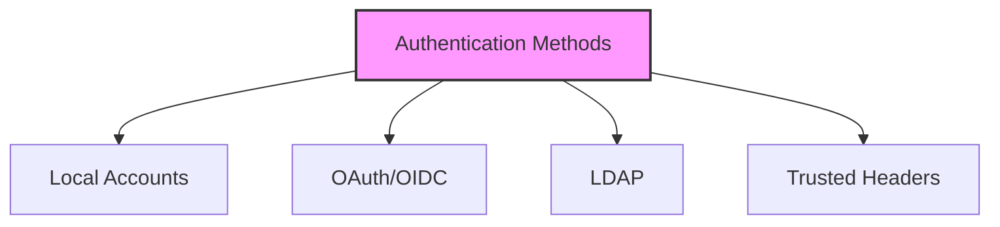

# OpenWebUI Configuration Reference

This comprehensive configuration guide combines all aspects of OpenWebUI setup, from common configurations to advanced features.

## Table of Contents

- [OpenWebUI Configuration Reference](#openwebui-configuration-reference)
  - [Table of Contents](#table-of-contents)
  - [Configuration Hierarchy](#configuration-hierarchy)
  - [Quick Reference: Common Configurations](#quick-reference-common-configurations)
  - [Core Features \& Configuration](#core-features--configuration)
    - [1. LLM Model Connectivity](#1-llm-model-connectivity)
    - [2. Document Processing \& RAG](#2-document-processing--rag)
    - [3. Web Search Integration](#3-web-search-integration)
    - [4. Speech-to-Text \& Text-to-Speech](#4-speech-to-text--text-to-speech)
    - [5. Image Generation](#5-image-generation)
  - [Authentication \& Security](#authentication--security)
  - [Feature Matrix](#feature-matrix)
    - [Web Search Providers](#web-search-providers)
    - [Document Extraction Options](#document-extraction-options)
  - [Complete Environment Variables Reference](#complete-environment-variables-reference)
    - [Core Configuration](#core-configuration)
    - [Security](#security)
    - [Database Configuration](#database-configuration)
    - [Advanced Settings](#advanced-settings)
  - [User Permissions](#user-permissions)
  - [Cloud Storage Options](#cloud-storage-options)
  - [Summary](#summary)

## Configuration Hierarchy

OpenWebUI applies settings in a specific order of precedence, giving you fine-grained control over your instance:

1. **Per-Chat Settings:** Applied only to the current conversation via chat controls sidebar
2. **Per-Account Settings:** Default settings for a user's account (User Settings > General)
3. **Per-Model Settings:** Administrator-defined parameters for specific models (Workspace > Models)

## Quick Reference: Common Configurations

Here are the most commonly used configuration variables for OpenWebUI:

| Variable | Type | Default | Description | Persistent |
|----------|------|---------|-------------|------------|
| `WEBUI_NAME` | `str` | `Open WebUI` | Sets the main WebUI name | Yes |
| `WEBUI_URL` | `str` | `http://localhost:3000` | URL where OpenWebUI is reachable | Yes |
| `PORT` | `int` | `8080` | Port to run OpenWebUI from | No |
| `ENABLE_SIGNUP` | `bool` | `True` | Toggles user account creation | Yes |
| `ENABLE_LOGIN_FORM` | `bool` | `True` | Toggles email, password, sign-in elements | Yes |
| `DEFAULT_USER_ROLE` | `str` | `pending` | Default role for new users (`pending`, `user`, `admin`) | Yes |
| `WEBUI_SECRET_KEY` | `str` | `t0p-s3cr3t` (random in Docker) | Key for JWT signing | No |
| `WEBUI_AUTH` | `bool` | `True` | Enables/disables authentication | No |
| `OLLAMA_BASE_URL` | `str` | `http://localhost:11434` (varies) | URL for Ollama backend | Yes |
| `OPENAI_API_BASE_URL` | `str` | `https://api.openai.com/v1` | URL for OpenAI or compatible API | Yes |
| `OPENAI_API_KEY` | `str` | - | API key for OpenAI or compatible services | Yes |
| `ENABLE_RAG_WEB_SEARCH` | `bool` | `False` | Enables web search for real-time info | Yes |
| `ENABLE_IMAGE_GENERATION` | `bool` | `False` | Enables image generation features | Yes |
| `CONTENT_EXTRACTION_ENGINE` | `str` | - | Document extraction engine (e.g., `tika`) | Yes |

**Note:** Variables marked as "Persistent" are stored in OpenWebUI's internal configuration after first launch. Subsequent changes must be made through the admin interface.

## Core Features & Configuration

### 1. LLM Model Connectivity

OpenWebUI can connect to various LLM providers:

| Variable | Type | Default | Description | Persistent |
|----------|------|---------|-------------|------------|
| `ENABLE_OLLAMA_API` | `bool` | `True` | Enables the use of Ollama APIs | Yes |
| `OLLAMA_BASE_URL` | `str` | `http://localhost:11434` (varies) | Configures the Ollama backend URL | No |
| `OLLAMA_BASE_URLS` | `str` | - | Semicolon-separated list of Ollama backends for load balancing | Yes |
| `ENABLE_OPENAI_API` | `bool` | `True` | Enables the use of OpenAI APIs | Yes |
| `OPENAI_API_BASE_URL` | `str` | `https://api.openai.com/v1` | Configures the OpenAI base API URL | Yes |
| `OPENAI_API_BASE_URLS` | `str` | - | Semicolon-separated list for OpenAI base API URLs | Yes |
| `OPENAI_API_KEY` | `str` | - | Sets the OpenAI API key | Yes |
| `OPENAI_API_KEYS` | `str` | - | Semicolon-separated list of OpenAI API keys | Yes |

### 2. Document Processing & RAG

OpenWebUI supports retrieval-augmented generation (RAG) with various document types:

| Variable | Type | Default | Description | Persistent |
|----------|------|---------|-------------|------------|
| `RAG_EMBEDDING_ENGINE` | `str` | - | Embedding engine for RAG (`ollama`, `openai`) | Yes |
| `RAG_EMBEDDING_MODEL` | `str` | `sentence-transformers/all-MiniLM-L6-v2` | Model for embeddings | Yes |
| `ENABLE_RAG_HYBRID_SEARCH` | `bool` | `False` | Enables hybrid search with `BM25` + `ChromaDB` | Yes |
| `CONTENT_EXTRACTION_ENGINE` | `str` | - | Content extraction engine (`tika`) | Yes |
| `RAG_TOP_K` | `int` | `3` | Default number of results for RAG | Yes |
| `CHUNK_SIZE` | `int` | `1000` | Document chunk size for embeddings | Yes |
| `CHUNK_OVERLAP` | `int` | `100` | Overlap between chunks | Yes |
| `TIKA_SERVER_URL` | `str` | `http://localhost:9998` | Apache Tika server URL | Yes |

### 3. Web Search Integration

Enable models to access current information via web search:

| Variable | Type | Default | Description | Persistent |
|----------|------|---------|-------------|------------|
| `ENABLE_RAG_WEB_SEARCH` | `bool` | `False` | Enables web search toggle | Yes |
| `RAG_WEB_SEARCH_RESULT_COUNT` | `int` | `3` | Maximum number of search results to crawl | Yes |
| `RAG_WEB_SEARCH_ENGINE` | `str` | - | Web search engine to use | Yes |
| `SEARXNG_QUERY_URL` | `str` | - | SearXNG search API URL | Yes |

### 4. Speech-to-Text & Text-to-Speech

| Variable | Type | Default | Description | Persistent |
|----------|------|---------|-------------|------------|
| `AUDIO_STT_ENGINE` | `str` | - | Speech-to-Text engine (`openai`) | Yes |
| `AUDIO_STT_MODEL` | `str` | `whisper-1` | Speech-to-Text model for OpenAI | Yes |
| `AUDIO_TTS_ENGINE` | `str` | - | Text-to-Speech engine (`azure`, `elevenlabs`, `openai`, `transformers`) | Yes |
| `AUDIO_TTS_VOICE` | `str` | `alloy` | OpenAI text-to-speech voice | Yes |

### 5. Image Generation

| Variable | Type | Default | Description | Persistent |
|----------|------|---------|-------------|------------|
| `ENABLE_IMAGE_GENERATION` | `bool` | `False` | Enables image generation features | Yes |
| `IMAGE_GENERATION_ENGINE` | `str` | `openai` | Engine for image generation (`openai`, `comfyui`, `automatic1111`) | Yes |
| `IMAGE_GENERATION_MODEL` | `str` | - | Default model for image generation | Yes |
| `IMAGE_SIZE` | `str` | `512x512` | Default image size to generate | Yes |

## Authentication & Security

OpenWebUI offers multiple authentication mechanisms:

| Variable | Type | Default | Description | Persistent |
|----------|------|---------|-------------|------------|
| `WEBUI_AUTH` | `bool` | `True` | Enables/disables authentication | No |
| `WEBUI_SECRET_KEY` | `str` | `t0p-s3cr3t` (random in Docker) | Key for JWT signing | No |
| `ENABLE_SIGNUP` | `bool` | `True` | Toggles user account creation | Yes |
| `DEFAULT_USER_ROLE` | `str` | `pending` | Default role for new users (`pending`, `user`, `admin`) | Yes |
| `ENABLE_OAUTH_SIGNUP` | `bool` | `False` | Enables account creation via OAuth | Yes |
| `ENABLE_API_KEY` | `bool` | `True` | Enables API key authentication | Yes |

## Feature Matrix

### Web Search Providers

| Provider | Type | API Key Required | Free Tier | Default Engine |
|----------|------|------------------|-----------|---------------|
| SearXNG | Self-hosted | No | Yes (Unlimited) | N/A |
| DuckDuckGo | Free | No | Yes (Rate limited) | N/A |
| Google PSE | Commercial | Yes | Limited (100 queries/day) | google |
| Bing | Commercial | Yes | Limited | N/A |
| Brave | Commercial | Yes | No | N/A |
| Kagi | Commercial | Yes | No | N/A |
| Mojeek | Commercial | Yes | Limited | N/A |
| Serper | Commercial | Yes | No | N/A |
| Tavily | Commercial | Yes | Limited | N/A |

### Document Extraction Options

| Provider | Type | Requirements | Supported Formats |
|----------|------|--------------|-------------------|
| Apache Tika | Self-hosted | Docker container | PDF, DOCX, TXT, etc. |
| Docling | Local | Python package | HTML, Markdown, PDF |
| Mistral OCR | API | API key | Images with text |

## Complete Environment Variables Reference

Below is the comprehensive list of all environment variables supported by OpenWebUI:

### Core Configuration

| Variable | Type | Default | Description | Persistent |
|----------|------|---------|-------------|------------|
| `ENV` | `str` (enum: `dev`, `prod`) | `dev` (Backend)\n`prod` (Docker) | Environment setting. `dev` enables FastAPI docs | No |
| `CUSTOM_NAME` | `str` | - | Sets `WEBUI_NAME` but polls API for metadata | No |
| `WEBUI_NAME` | `str` | `Open WebUI` | Sets the main WebUI name | Yes |
| `WEBUI_URL` | `str` | `http://localhost:3000` | URL where OpenWebUI is reachable | Yes |
| `PORT` | `int` | `8080` | Port to run OpenWebUI from | No |
| `ENABLE_SIGNUP` | `bool` | `True` | Toggles user account creation | Yes |
| `ENABLE_LOGIN_FORM` | `bool` | `True` | Toggles email, password, sign-in elements | Yes |
| `DEFAULT_USER_ROLE` | `str` (enum) | `pending` | Default role for new users (`pending`, `user`, `admin`) | Yes |
| `DEFAULT_LOCALE` | `str` | `en` | Default locale for the application | Yes |
| `WEBUI_BUILD_HASH` | `str` | `dev-build` | Identifies Git SHA for releases | No |
| `DATA_DIR` | `str` | `./data` | Base directory for data storage | No |

### Security

| Variable | Type | Default | Description | Persistent |
|----------|------|---------|-------------|------------|
| `WEBUI_AUTH` | `bool` | `True` | Enables/disables authentication | No |
| `WEBUI_SECRET_KEY` | `str` | `t0p-s3cr3t` (randomly generated in Docker) | Key for JSON Web Token signing | No |
| `WEBUI_SESSION_COOKIE_SAME_SITE` | `str` (enum) | `lax` | SameSite attribute for session cookies (`lax`, `strict`, `none`) | No |
| `WEBUI_SESSION_COOKIE_SECURE` | `bool` | `False` | Sets the Secure attribute for session cookies | No |
| `WEBUI_AUTH_COOKIE_SAME_SITE` | `str` (enum) | `lax` | SameSite attribute for auth cookies | No |
| `WEBUI_AUTH_COOKIE_SECURE` | `bool` | `False` | Sets the Secure attribute for auth cookies | No |
| `ENABLE_FORWARD_USER_INFO_HEADERS` | `bool` | `False` | Forwards user info (name, id, email, role) as X-headers | No |
| `ENABLE_RAG_LOCAL_WEB_FETCH` | `bool` | `False` | Enables local web fetching for RAG | No |
| `ENABLE_RAG_WEB_LOADER_SSL_VERIFICATION` | `bool` | `True` | Controls SSL verification for RAG on websites | Yes |
| `CORS_ALLOW_ORIGIN` | `str` | `*` | Sets allowed origins for CORS | No |

### Database Configuration

| Variable | Type | Default | Description | Persistent |
|----------|------|---------|-------------|------------|
| `DATABASE_URL` | `str` | `sqlite:///${DATA_DIR}/webui.db` | Database URL to connect to | No |
| `DATABASE_POOL_SIZE` | `int` | `0` | Database pool size (0 disables pooling) | No |
| `DATABASE_POOL_MAX_OVERFLOW` | `int` | `0` | Database pool max overflow | No |
| `DATABASE_POOL_TIMEOUT` | `int` | `30` | Timeout in seconds to get a connection | No |
| `DATABASE_POOL_RECYCLE` | `int` | `3600` | Database pool recycle time in seconds | No |

### Advanced Settings

| Variable | Type | Default | Description | Persistent |
|----------|------|---------|-------------|------------|
| `ENABLE_REALTIME_CHAT_SAVE` | `bool` | `False` | Save streamed chat data in real time | No |
| `ENABLE_ADMIN_EXPORT` | `bool` | `True` | Controls admin data export ability | No |
| `ENABLE_ADMIN_CHAT_ACCESS` | `bool` | `True` | Allows admin access to all chats | No |
| `ENABLE_CHANNELS` | `bool` | `False` | Enables channel support | Yes |
| `ADMIN_EMAIL` | `str` | - | Admin email for `SHOW_ADMIN_DETAILS` | Yes |
| `SHOW_ADMIN_DETAILS` | `bool` | `True` | Shows admin details in interface | Yes |
| `BYPASS_MODEL_ACCESS_CONTROL` | `bool` | `False` | Bypasses model access control | No |
| `DEFAULT_MODELS` | `str` | - | Default Language Model | Yes |
| `WEBHOOK_URL` | `str` | - | Webhook for Discord/Slack/Teams integration | Yes |
| `JWT_EXPIRES_IN` | `int` | `-1` | JWT expiration time in seconds | Yes |
| `ENABLE_CODE_INTERPRETER` | `bool` | `True` | Enables code interpreter features | Yes |
| `ENABLE_AUTOCOMPLETE_GENERATION` | `bool` | `True` | Enables autocomplete generation | Yes |
| `ENABLE_EVALUATION_ARENA_MODELS` | `bool` | `True` | Enables evaluation arena models | Yes |
| `ENABLE_MESSAGE_RATING` | `bool` | `True` | Enables message rating feature | Yes |
| `ENABLE_COMMUNITY_SHARING` | `bool` | `True` | Controls community share button | Yes |
| `ENABLE_TAGS_GENERATION` | `bool` | `True` | Enables tags generation | Yes |

## User Permissions

OpenWebUI offers fine-grained user permission controls:

| Variable | Default | Description | Persistent |
|----------|---------|-------------|------------|
| `USER_PERMISSIONS_WORKSPACE_MODELS` | `False` | Allow users to access Models in Workspace | Yes |
| `USER_PERMISSIONS_WORKSPACE_KNOWLEDGE` | `False` | Allow users to access Knowledge in Workspace | Yes |
| `USER_PERMISSIONS_WORKSPACE_PROMPTS` | `False` | Allow users to access Prompts in Workspace | Yes |
| `USER_PERMISSIONS_WORKSPACE_TOOLS` | `False` | Allow users to access Tools in Workspace | Yes |
| `USER_PERMISSIONS_CHAT_DELETE` | `True` | Allow users to delete chats | Yes |
| `USER_PERMISSIONS_CHAT_EDIT` | `True` | Allow users to edit messages | Yes |
| `USER_PERMISSIONS_CHAT_FILE_UPLOAD` | `True` | Allow users to upload files | Yes |
| `USER_PERMISSIONS_CHAT_TEMPORARY` | `True` | Allow users to create temporary chats | Yes |

## Cloud Storage Options

| Variable | Type | Default | Description | Persistent |
|----------|------|---------|-------------|------------|
| `STORAGE_PROVIDER` | `str` (enum) | - | Storage provider (`s3`, `gcs`) | No |
| `S3_ACCESS_KEY_ID` | `str` | - | Access key ID for S3 | No |
| `S3_BUCKET_NAME` | `str` | - | Bucket name for S3 | No |
| `S3_ENDPOINT_URL` | `str` | - | Endpoint URL for S3 | No |
| `S3_KEY_PREFIX` | `str` | - | Key prefix for S3 object | No |
| `S3_REGION_NAME` | `str` | - | Region name for S3 | No |
| `S3_SECRET_ACCESS_KEY` | `str` | - | Secret access key for S3 | No |
| `GOOGLE_APPLICATION_CREDENTIALS_JSON` | `str` | - | Google Application Credentials JSON | No |
| `GCS_BUCKET_NAME` | `str` | - | Bucket name for Google Cloud Storage | No |
| `ENABLE_GOOGLE_DRIVE_INTEGRATION` | `bool` | `False` | Enables Google Drive integration | Yes |
| `GOOGLE_DRIVE_CLIENT_ID` | `str` | - | Client ID for Google Drive | Yes |
| `GOOGLE_DRIVE_API_KEY` | `str` | - | API key for Google Drive | Yes |

## Summary

This comprehensive guide covers all aspects of OpenWebUI configuration. For specific integration guides, refer to the dedicated documentation pages for each feature. 