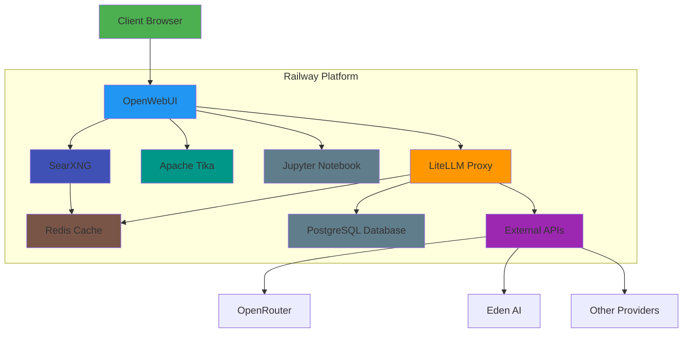
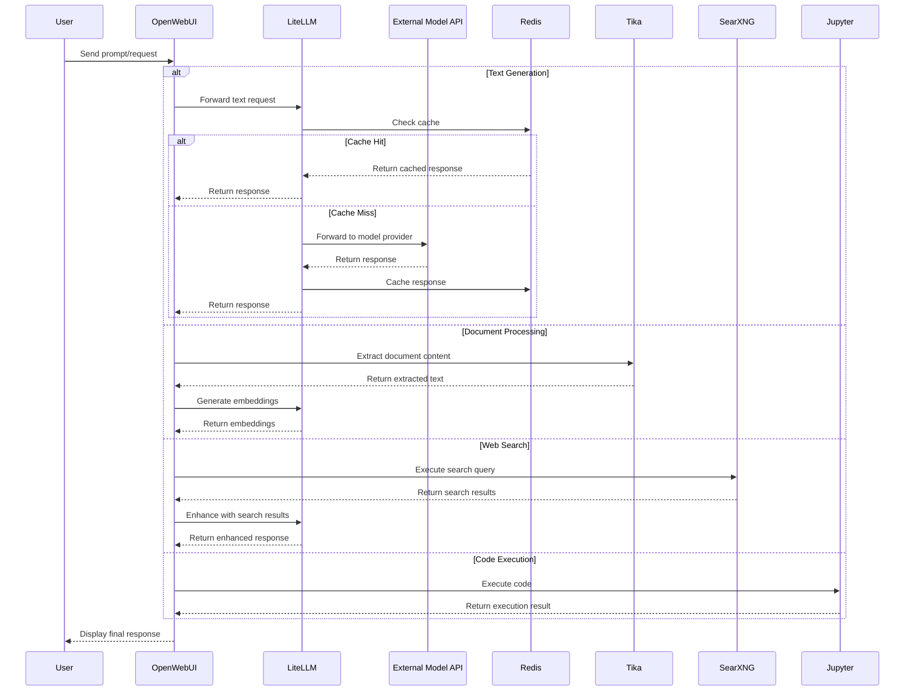

# Unified AI Platform Architecture

This document provides a technical overview of the Unified AI Platform architecture, components, and integration patterns as implemented on Railway.

## Table of Contents

- [Unified AI Platform Architecture](#unified-ai-platform-architecture)
  - [Table of Contents](#table-of-contents)
  - [System Overview](#system-overview)
  - [Core Components](#core-components)
    - [Frontend: OpenWebUI](#frontend-openwebui)
    - [Model Proxy: LiteLLM](#model-proxy-litellm)
    - [Database: PostgreSQL](#database-postgresql)
    - [Caching: Redis](#caching-redis)
    - [Document Processing: Apache Tika](#document-processing-apache-tika)
    - [Web Search: SearXNG](#web-search-searxng)
    - [Code Execution: Jupyter Notebook](#code-execution-jupyter-notebook)
  - [Integration Architecture](#integration-architecture)
  - [Network Architecture](#network-architecture)
    - [Railway Internal Network](#railway-internal-network)
    - [External Access Points](#external-access-points)
  - [Service Configuration](#service-configuration)
  - [Data Flow](#data-flow)
  - [Security Considerations](#security-considerations)
    - [API Key Management](#api-key-management)
    - [Authentication](#authentication)
    - [Service Isolation](#service-isolation)
  - [Performance Considerations](#performance-considerations)
    - [Caching Strategy](#caching-strategy)
    - [Resource Allocation](#resource-allocation)
  - [Monitoring and Maintenance](#monitoring-and-maintenance)
    - [Service Monitoring](#service-monitoring)
    - [Upgrade Strategy](#upgrade-strategy)
    - [Backup Procedures](#backup-procedures)

## System Overview

The Unified AI Platform integrates multiple AI services through a single interface, allowing users to access various AI capabilities without switching between different tools and applications. The architecture is implemented as a collection of microservices deployed on Railway.

## Core Components

### Frontend: OpenWebUI

OpenWebUI provides a modern, responsive interface for interacting with AI models and services. It serves as the central access point for all platform features.

**Implementation Details:**
- Docker Image: `ghcr.io/open-webui/open-webui:latest`
- Environment Configuration:
  - Connects to LiteLLM API for model access
  - Connects to Tika for document processing
  - Connects to SearXNG for web search
  - Connects to JupyterLab for code execution

**Key Features:**
- Chat interface with message history
- Document upload and management for RAG
- Knowledge base creation and management
- Code execution through JupyterLab integration
- Model selection and parameter adjustment
- Admin interface for system configuration

### Model Proxy: LiteLLM

LiteLLM acts as a universal API proxy, allowing a single interface to connect to multiple AI model providers.

**Implementation Details:**
- Docker Image: `ghcr.io/berriai/litellm:main`
- Storage: PostgreSQL database for configuration and logs
- Caching: Redis for response caching

**Key Capabilities:**
- Unified API format (OpenAI-compatible)
- Support for multiple model providers (OpenRouter, EdenAI, etc.)
- Request routing and load balancing
- Response caching through Redis
- Cost tracking and budget management
- API key management
- Admin UI for configuration

### Database: PostgreSQL

PostgreSQL provides persistent storage for LiteLLM configuration, API keys, and usage logs.

**Implementation Details:**
- Service: Railway managed PostgreSQL instance
- Usage: Stores LiteLLM configuration, models, and usage data

### Caching: Redis

Redis provides high-performance caching for LiteLLM responses, reducing API costs and improving response times.

**Implementation Details:**
- Docker Image: `redis:alpine`
- Usage:
  - LiteLLM response caching
  - Rate limiting for SearXNG

### Document Processing: Apache Tika

Apache Tika extracts text and metadata from various document formats for use in RAG systems.

**Implementation Details:**
- Docker Image: `apache/tika:latest-full`
- Access: HTTP API on default port

**Supported Formats:**
- PDF
- Microsoft Office documents (DOCX, XLSX, PPTX)
- Text files
- HTML
- Images (with OCR)
- And many more

### Web Search: SearXNG

SearXNG provides private, metasearch capabilities that allow AI models to retrieve up-to-date information from the web.

**Implementation Details:**
- Docker Image: `searxng/searxng`
- Configuration: Custom instance name and secret key

**Benefits:**
- Privacy-preserving search
- No API key required
- Multiple search engines aggregated
- Customizable result format

### Code Execution: Jupyter Notebook

Jupyter Notebook enables safe execution of code generated or requested by AI models.

**Implementation Details:**
- Docker Image: `jupyter/minimal-notebook:latest`
- Authentication: Password-based access

**Features:**
- Support for multiple programming languages
- Interactive execution environment
- Data visualization
- Isolated execution environment
- Token-based authentication

## Integration Architecture

## Network Architecture

### Railway Internal Network

All services communicate over Railway's internal network for enhanced security and performance. Services are connected using Railway's reference variables to enable visualization in the Architecture UI.

| Service | Internal Domain | External Domain | Reference Variable Example |
|---------|----------------|----------------|---------|
| OpenWebUI | openwebui.railway.internal | [generated-domain].up.railway.app | N/A (consumer service) |
| LiteLLM | litellm.railway.internal | [generated-domain].up.railway.app | `${{litellm-ruOg.RAILWAY_PUBLIC_DOMAIN}}` |
| PostgreSQL | [db-instance].railway.internal | N/A | Database connection string |
| Redis | redis.railway.internal | N/A | `${{redis.RAILWAY_PRIVATE_DOMAIN}}` |
| Tika | tika.railway.internal | [generated-domain].up.railway.app | `${{tika.RAILWAY_PUBLIC_DOMAIN}}` |
| SearXNG | searxng.railway.internal | [generated-domain].up.railway.app | `${{searxng.RAILWAY_PUBLIC_DOMAIN}}` |
| JupyterLab | jupyterlab.railway.internal | [generated-domain].up.railway.app | `${{JupyterLab.RAILWAY_PUBLIC_DOMAIN}}` |

**Service Connection Pattern:**
- Services connect using Railway's reference variables syntax (`${{service.VARIABLE}}`)
- Private connections use `RAILWAY_PRIVATE_DOMAIN` for internal traffic
- Public connections use `RAILWAY_PUBLIC_DOMAIN` for external access
- Port references use `RAILWAY_TCP_APPLICATION_PORT` for dynamic port assignments

This reference variable approach ensures that:
1. Service connections are visible in the Railway Architecture UI
2. Configuration automatically updates if domains or ports change
3. Services can be moved or renamed with minimal reconfiguration

### External Access Points

Only certain services are exposed publicly:

1. **OpenWebUI** - Main user interface
2. **LiteLLM** - Admin configuration interface
3. **Tika** - Document processing API
4. **SearXNG** - Search engine interface
5. **JupyterLab** - Code execution environment

## Service Configuration

Services are configured through environment variables set in the Railway dashboard. Each service has its own set of configuration parameters:

- **OpenWebUI**: Configured to connect to other services and customize UI appearance
- **LiteLLM**: Configured with API provider keys and performance settings
- **PostgreSQL**: Standard database connection parameters
- **Redis**: No special configuration required (defaults)
- **Tika**: No special configuration required (defaults)
- **SearXNG**: Configured with instance name and security settings
- **JupyterLab**: Configured with authentication parameters

## Data Flow

1. **User Requests**:
   - Users interact with OpenWebUI for all AI operations
   - OpenWebUI routes requests to appropriate backend services

2. **Text Generation**:
   - OpenWebUI sends prompt to LiteLLM
   - LiteLLM checks Redis cache
   - If cache miss, LiteLLM forwards to external API
   - Response is cached and returned

3. **Document Processing**:
   - Documents uploaded to OpenWebUI
   - OpenWebUI sends to Tika for extraction
   - Extracted text is processed and stored
   - Text can be used for RAG queries

4. **Web Search**:
   - OpenWebUI sends search query to SearXNG
   - SearXNG aggregates results from search engines
   - Results are integrated into AI responses

5. **Code Execution**:
   - Code sent from OpenWebUI to JupyterLab
   - JupyterLab executes and returns results
   - Results displayed in OpenWebUI

## Security Considerations

### API Key Management

- API keys stored securely as environment variables
- LiteLLM master key used for authentication
- External provider keys (OpenRouter, EdenAI) secured in LiteLLM

### Authentication

- OpenWebUI requires user authentication
- JupyterLab secured with token authentication
- LiteLLM admin UI password protected

### Service Isolation

- Services operate in isolated containers
- Internal communication uses Railway's secure network
- Limited external exposure of services

## Performance Considerations

### Caching Strategy

- LiteLLM uses Redis for caching responses
- Reduces duplicate API calls and costs
- Improves response times for common queries

### Resource Allocation

- Each service can be independently scaled
- Railway automatically handles container orchestration
- Services can be assigned appropriate resources based on needs

## Monitoring and Maintenance

### Service Monitoring

- Railway dashboard provides service status
- Logs available for each service
- Health checks can be implemented for critical services

### Upgrade Strategy

- Services can be updated individually
- Docker images tagged with specific versions for stability
- Testing recommended before updating production services

### Backup Procedures

- Database backups for PostgreSQL
- Volume backups for OpenWebUI data
- Regular exports of important configurations 