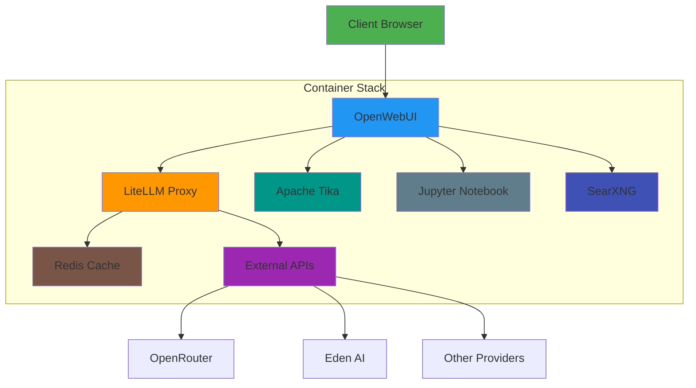
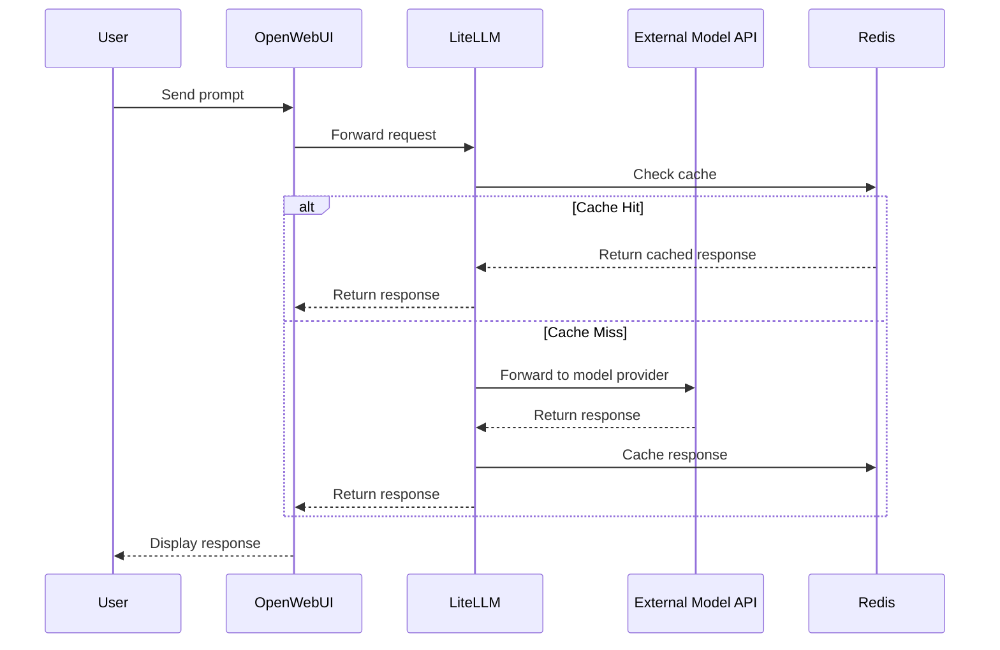
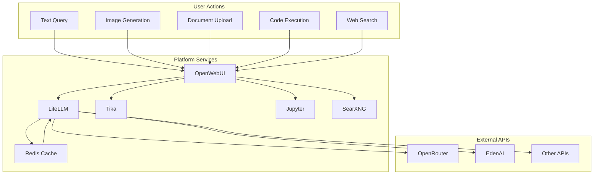

# Unified AI Platform Architecture

This document provides a technical overview of the Unified AI Platform architecture, components, and integration patterns.

## Table of Contents

- [Unified AI Platform Architecture](#unified-ai-platform-architecture)
  - [Table of Contents](#table-of-contents)
  - [System Overview](#system-overview)
  - [Core Components](#core-components)
    - [Frontend: OpenWebUI](#frontend-openwebui)
    - [Model Proxy: LiteLLM](#model-proxy-litellm)
    - [Document Processing: Apache Tika](#document-processing-apache-tika)
    - [Web Search: SearXNG](#web-search-searxng)
    - [Code Execution: Jupyter Notebook](#code-execution-jupyter-notebook)
    - [Caching: Redis](#caching-redis)
  - [Integration Architecture](#integration-architecture)
  - [Network Architecture](#network-architecture)
    - [Internal Container Network](#internal-container-network)
    - [External Access Points](#external-access-points)
  - [Configuration Files](#configuration-files)
    - [docker-compose.yml](#docker-composeyml)
    - [litellm/config.yaml](#litellmconfigyaml)
  - [Data Flow](#data-flow)
  - [Security Considerations](#security-considerations)
    - [API Key Management](#api-key-management)
    - [Authentication](#authentication)
    - [Container Isolation](#container-isolation)
  - [Customization Options](#customization-options)
    - [Adding New Models](#adding-new-models)
    - [Integrating Additional Services](#integrating-additional-services)
  - [Performance Considerations](#performance-considerations)
    - [Caching Strategy](#caching-strategy)
    - [Resource Requirements](#resource-requirements)
  - [Monitoring and Logging](#monitoring-and-logging)
    - [LiteLLM Logging](#litellm-logging)
    - [Container Logs](#container-logs)
  - [Railway-Specific Architecture](#railway-specific-architecture)
  - [Conclusion](#conclusion)

## System Overview

The Unified AI Platform integrates multiple AI services through a single interface, allowing users to access various AI capabilities without switching between different tools and applications.



## Core Components

### Frontend: OpenWebUI

OpenWebUI provides a modern, responsive interface for interacting with AI models and services. It serves as the central access point for all platform features.

**Key Features:**
- Chat interface with message history
- Document upload and management for RAG
- Knowledge base creation and management
- Code execution environment
- Model selection and parameter adjustment
- Admin interface for system configuration

### Model Proxy: LiteLLM

LiteLLM acts as a universal API proxy, allowing a single interface to connect to multiple AI model providers.

**Key Capabilities:**
- Unified API format (OpenAI-compatible)
- Support for multiple model providers
- Request routing and load balancing
- Response caching
- Cost tracking and budget management
- Fallback strategies
- API key management

### Document Processing: Apache Tika

Apache Tika extracts text and metadata from various document formats for use in RAG systems.

**Supported Formats:**
- PDF
- Microsoft Office documents (DOCX, XLSX, PPTX)
- Text files
- HTML
- Images (with OCR)
- And many more

### Web Search: SearXNG

SearXNG provides private, metasearch capabilities that allow AI models to retrieve up-to-date information from the web.

**Benefits:**
- Privacy-preserving search
- No API key required
- Multiple search engines aggregated
- Customizable result format

### Code Execution: Jupyter Notebook

Jupyter Notebook enables safe execution of code generated or requested by AI models.

**Features:**
- Support for multiple programming languages
- Interactive execution environment
- Data visualization
- Isolated execution environment
- Token-based authentication

### Caching: Redis

Redis provides high-performance caching for LiteLLM responses, reducing API costs and improving response times.

## Integration Architecture



## Network Architecture

### Internal Container Network

All services communicate over an internal Docker network, with OpenWebUI as the primary interface to other services.

| Service | Internal Port | External Port | Internal URL |
|---------|--------------|--------------|--------------|
| OpenWebUI | 8080 | 3000 | http://openwebui:8080 |
| LiteLLM | 4000 | 4000 | http://litellm:4000 |
| Jupyter | 8888 | N/A | http://jupyter:8888 |
| Tika | 9998 | N/A | http://tika:9998 |
| SearXNG | 8080 | N/A | http://searxng:8080 |
| Redis | 6379 | N/A | redis://cache:6379 |

### External Access Points

Only two services are exposed externally:
1. **OpenWebUI** (port 3000) - Main user interface
2. **LiteLLM** (port 4000) - Admin configuration interface

## Configuration Files

### docker-compose.yml

The `docker-compose.yml` file defines all services and their relationships:

```yaml
version: "3.8"
services:
  openwebui:
    image: ghcr.io/open-webui/open-webui:latest
    ports:
      - "3000:8080"
    environment:
      - OPENAI_API_BASE_URL=http://litellm:4000/v1
      - OPENAI_API_KEY=${LITELLM_MASTER_KEY}
      - CONTENT_EXTRACTION_ENGINE=tika
      - TIKA_SERVER_URL=http://tika:9998
      - ENABLE_RAG_WEB_SEARCH=true
      - RAG_WEB_SEARCH_ENGINE=searxng
      - SEARXNG_QUERY_URL=http://searxng:8080/search?q=<query>
    volumes:
      - openwebui-data:/app/backend/data
    depends_on:
      - litellm
      - tika
      - searxng

  litellm:
    image: ghcr.io/berriai/litellm:main
    ports:
      - "4000:4000"
    environment:
      - LITELLM_CONFIG_PATH=/app/config.yaml
      - OPENROUTER_API_KEY=${OPENROUTER_API_KEY}
      - EDENAI_API_KEY=${EDENAI_API_KEY}
      - LITELLM_MASTER_KEY=${LITELLM_MASTER_KEY}
    volumes:
      - ./litellm/config.yaml:/app/config.yaml
    depends_on:
      - cache

  cache:
    image: redis:alpine
    volumes:
      - redis-data:/data

  jupyter:
    image: jupyter/minimal-notebook:latest
    environment:
      - JUPYTER_TOKEN=${JUPYTER_TOKEN}
    volumes:
      - jupyter-data:/home/jovyan/work

  tika:
    image: apache/tika:latest-full

  searxng:
    image: searxng/searxng
    environment:
      - SEARXNG_BASE_URL=${SEARXNG_BASE_URL:-http://localhost:8080/}
    volumes:
      - searxng-data:/etc/searxng

volumes:
  openwebui-data:
  redis-data:
  jupyter-data:
  searxng-data:
```

### litellm/config.yaml

This configuration defines available models and LiteLLM settings:

```yaml
model_list:
  # Text models via OpenRouter
  - model_name: gpt-3.5-turbo
    litellm_params:
      model: openrouter/openai/gpt-3.5-turbo
      api_key: ${OPENROUTER_API_KEY}

  - model_name: gpt-4
    litellm_params:
      model: openrouter/openai/gpt-4
      api_key: ${OPENROUTER_API_KEY}
  
  - model_name: claude-3-opus
    litellm_params:
      model: openrouter/anthropic/claude-3-opus
      api_key: ${OPENROUTER_API_KEY}

  # Image models via EdenAI
  - model_name: dall-e-3
    litellm_params:
      model: edenai/openai/dall-e-3
      api_key: ${EDENAI_API_KEY}
  
  - model_name: midjourney
    litellm_params:
      model: edenai/midjourney/v6
      api_key: ${EDENAI_API_KEY}

general_settings:
  completion_to_prompt: true
  default_fallback_strategy: "longest_context"
  
  cache: true
  cache_params:
    type: "redis"
    host: "cache"
    port: 6379
    
  log_level: "info"

router_settings:
  expose_ui: true
  ui_username: "${LITELLM_UI_USERNAME:-admin}"
  ui_password: "${LITELLM_UI_PASSWORD:-${LITELLM_MASTER_KEY}}"
```

## Data Flow



## Security Considerations

### API Key Management

API keys are stored as environment variables and never exposed to end users. The LiteLLM proxy acts as an abstraction layer, allowing the frontend to communicate with AI providers without direct access to API keys.

### Authentication

1. **User Authentication**: OpenWebUI provides user management with role-based access control
2. **Service Authentication**: 
   - LiteLLM UI is protected with username/password
   - Jupyter requires a token for access
   - Internal services are not exposed externally

### Container Isolation

Each service runs in its own container with limited permissions and access to resources.

## Customization Options

### Adding New Models

To add new models, update the `litellm/config.yaml` file:

```yaml
model_list:
  # Add your new model
  - model_name: new-model-name
    litellm_params:
      model: provider/model-identifier
      api_key: ${PROVIDER_API_KEY}
```

### Integrating Additional Services

1. Add the service to the `docker-compose.yml` file
2. Configure OpenWebUI to communicate with the new service
3. Update environment variables and volumes as needed

## Performance Considerations

### Caching Strategy

LiteLLM implements response caching via Redis to:
- Reduce API costs by reusing identical requests
- Decrease response time for common queries
- Reduce load on external APIs

### Resource Requirements

Minimum recommended resources for the full platform:
- 2 CPU cores
- 4GB RAM
- 20GB storage

For optimal performance:
- 4+ CPU cores
- 8+ GB RAM
- 50+ GB storage (especially for document storage)

## Monitoring and Logging

### LiteLLM Logging

LiteLLM provides comprehensive logging of:
- Request volume
- Token usage
- API costs
- Errors and retries

### Container Logs

All container logs are accessible through the Docker or Railway interface.

## Railway-Specific Architecture

When deployed on Railway, the platform benefits from:

1. **Automatic scaling**: Railway can scale resources based on demand
2. **Managed networking**: Railway handles port mapping and domains
3. **Environment variable management**: Secure storage of API keys
4. **Persistent volumes**: Data is preserved between deployments
5. **Automatic restarts**: Failed containers are restarted automatically

## Conclusion

The Unified AI Platform provides a comprehensive, self-hosted alternative to commercial AI platforms, with centralized management of models, data, and services. By leveraging open-source components and a modular architecture, it delivers a flexible and extensible system that can be customized to specific needs while maintaining seamless integration between all components. 