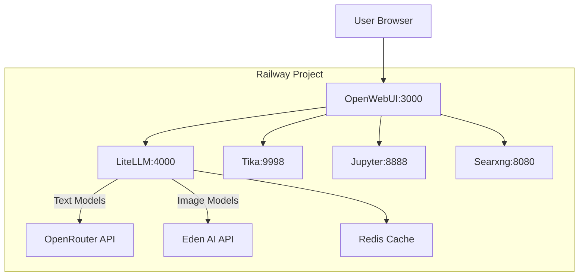
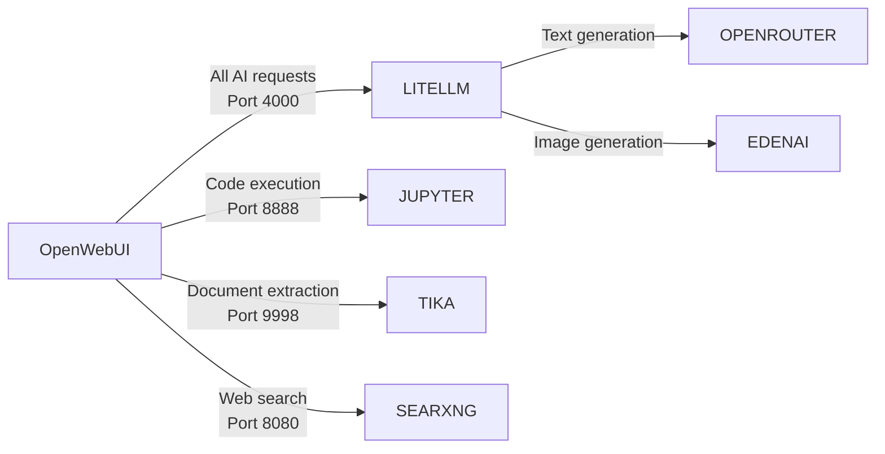

# System Patterns

## System Architecture

The Unified AI Platform follows a containerized microservices architecture with the following key components and relationships:

### Core Architecture

### Connection Flow

### Data Flow Patterns

The system follows a request-response pattern where:

1. User requests enter through OpenWebUI
2. Requests are routed to the appropriate service based on type
3. Services process the request and return results
4. OpenWebUI aggregates and displays the final output to the user

## Key Technical Decisions

### 1. Centralized Model Proxy

LiteLLM serves as a central proxy for all AI model interactions, providing:
- Unified logging
- Cost management with budget controls
- Fallback model configuration
- Caching via Redis for reduced API calls
- Rate limiting to prevent throttling

### 2. Docker Containerization

All services are containerized using Docker for:
- Consistent deployment across environments
- Easy scaling and management
- Clear separation of concerns
- Simplified configuration via environment variables

### 3. Railway Deployment

The platform uses Railway for deployment, providing:
- Managed container orchestration
- Automatic restarts on failure
- Simple domain and networking configuration
- Environment variable management
- Continuous deployment from GitHub

### 4. Service Integration Pattern

The system uses direct HTTP communication between services within the internal network, with each service responsible for a distinct function but accessible through a unified frontend.

## Component Relationships

| Component | Depends On | Provides To |
| --- | --- | --- |
| OpenWebUI | LiteLLM, Tika, Jupyter, SearxNG | User interface |
| LiteLLM | Redis, OpenRouter API, EdenAI API | Model access to OpenWebUI |
| Redis | None | Caching for LiteLLM |
| Jupyter | None | Code execution for OpenWebUI |
| Tika | None | Document extraction for OpenWebUI |
| SearxNG | None | Web search for OpenWebUI |

## Design Patterns

1. **Proxy Pattern**: LiteLLM acts as a proxy for multiple AI model providers
2. **Façade Pattern**: OpenWebUI provides a unified interface to multiple subsystems
3. **Cache-Aside Pattern**: Redis provides caching for expensive API calls
4. **Microservices Pattern**: Each component focuses on a specific functionality
5. **Configuration as Code**: All setup is defined in configuration files
6. **Environment-Based Configuration**: Using environment variables for flexibility 